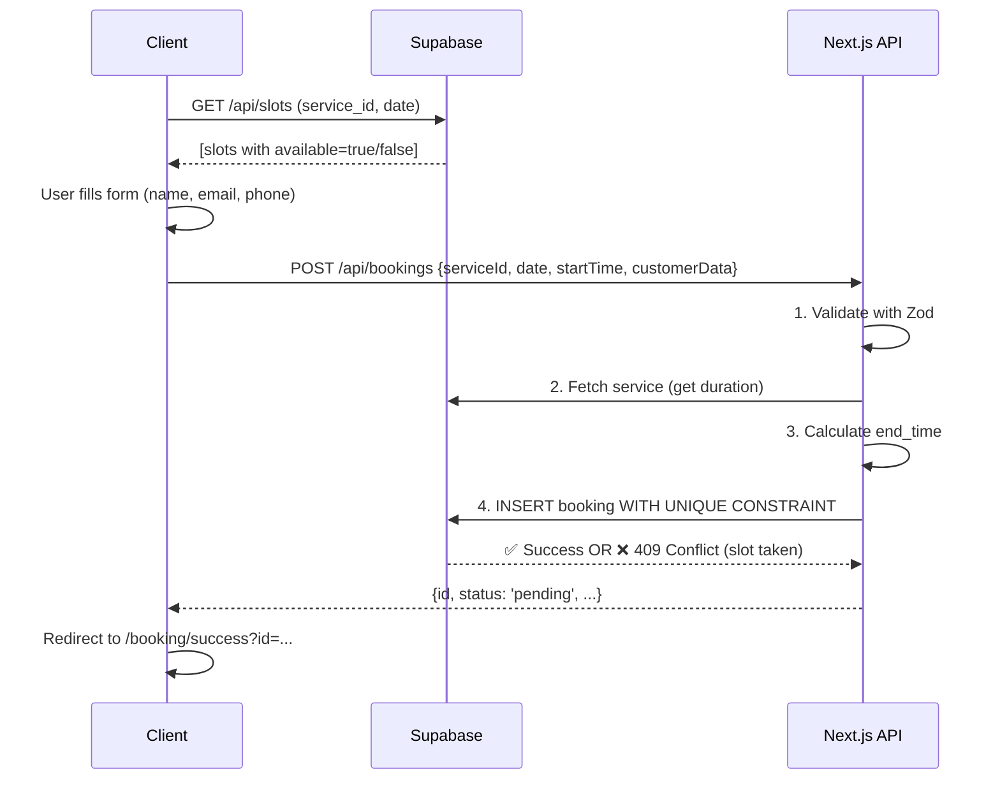

# SportBook - Architecture & Design Decisions

## 🏗️ High-Level Architecture

```
┌─────────────────────────────────────────────────────────────┐
│                   CLIENT (Browser)                           │
│  • React Components (TSX)                                   │
│  • Booking UI (steps, forms, tables)                        │
│  • Admin Dashboard                                          │
│  • Magic Link Auth Flow                                     │
└─────────────────────────────────────────────────────────────┘
                            ↓ (HTTPS)
┌─────────────────────────────────────────────────────────────┐
│              NEXT.JS SERVER (App Router)                     │
│  • App Routes: /booking, /admin, /services, /contact        │
│  • API Routes: GET /api/slots, POST /api/bookings           │
│  • Server Components (optional)                             │
│  • Middleware: Admin protection                             │
└─────────────────────────────────────────────────────────────┘
                            ↓ (Auth + Data)
┌─────────────────────────────────────────────────────────────┐
│            SUPABASE (Backend as a Service)                   │
│  • PostgreSQL Database (tables, RLS policies)               │
│  • Auth: Magic Links (OTP)                                  │
│  • Realtime (optional for admin updates)                    │
│  • Row-Level Security (RLS): Automatic access control       │
│  • Storage (optional for images)                            │
└─────────────────────────────────────────────────────────────┘
```

## 🔀 Key Design Decisions

### 1. Why Supabase?

✅ **Pros:**
- Instant PostgreSQL + Auth + Real-time
- Row-Level Security (RLS) - built-in authorization
- Free tier sufficient for MVP/DEMO
- No need for separate backend server

❌ **Cons:**
- Vendor lock-in
- Limited custom server logic (need API routes for complex ops)

**Decision**: Use Supabase for rapid prototyping of DEMO project.

### 2. User Authentication: Magic Links (OTP)

**Why not passwords?**
- No password storage needed
- Better UX (one-click login)
- Secure (time-limited links)

**Flow:**
```
User enters email → Supabase sends OTP → User clicks link → Auth verified
```

**Admin Access:**
- Email must exist in `admin_users` table (allowlist)
- No role-based permissions needed for DEMO

### 3. Booking Protection: UNIQUE Constraint + Server Check

**Problem**: Two users click the same slot at the same time.

**Solution**: Two-layer defense

```
Layer 1: Server-side check before insert
  → Query: Are there any bookings for (service_id, date, start_time)?
  → If yes: reject with 409 Conflict

Layer 2: Database unique constraint
  → UNIQUE(service_id, date, start_time)
  → If insert fails: reject with integrity error
```

**Why two layers?**
- Layer 1: Better UX (faster feedback)
- Layer 2: Guarantee (even if Layer 1 has race condition)

### 4. Slot Generation: Availability Windows

**Database Model**: Two separate concerns

```
availability         → Time windows when center is OPEN
  • service_id: which service
  • date: which day
  • start_time-end_time: when center is open (e.g., 09:00-17:00)
  • is_available: boolean flag

bookings             → Actual reservations
  • service_id, date, start_time, end_time: exact slot
  • customer info
  • status: pending/confirmed/cancelled
```

**Slot generation logic:**
```
GET /api/slots?serviceId=X&date=2024-03-15
  1. Find all availability windows for this service X on this date
  2. For each window (09:00-17:00):
     - Split into slots of service duration (e.g., 60 minutes)
     - Generate: [09:00-10:00, 10:00-11:00, ..., 16:00-17:00]
  3. Query bookings: which (start_time, end_time) are taken?
  4. Return array with available=true/false for each slot
```

**Why not pre-generate slots?**
- Flexibility: Can change service duration without regenerating
- Efficiency: Generated on-demand (minimal DB queries)
- Automatic handling of availability window changes

### 5. Client vs Server Supabase

**Two separate clients:**

```typescript
// lib/db/client.ts (Browser)
const supabase = createClient(ANON_KEY)  // Limited scope
// Can only:
// - Read public data (services, availability)
// - Insert bookings (RLS allows it)
// - NOT read other bookings (RLS forbids)

// lib/db/server.ts (Server/API)
const supabaseAdmin = createClient(SERVICE_ROLE_KEY)  // Full power
// Can do anything (bypasses RLS for admin purposes)
```

**Why separate?**

1. **Security**: ANON_KEY can't read sensitive data
2. **Permissions**: SERVICE_ROLE_KEY only used in secure API routes (never exposed)
3. **Best practice**: Principle of least privilege

### 6. RLS Policies: Automatic Authorization

```sql
-- services: Anyone can see active services
CREATE POLICY "public_read_active"
  ON services FOR SELECT
  USING (is_active = TRUE);

-- bookings: Public can insert, but NOT select
CREATE POLICY "public_insert_bookings"
  ON bookings FOR INSERT
  WITH CHECK (TRUE);  -- Allow anyone

CREATE POLICY "public_no_select_bookings"
  ON bookings FOR SELECT
  USING (FALSE);  -- Block anyone
```

**Why RLS instead of API-only access?**

|  | RLS (Database level) | API-only (Application level) |
|--|--|--|
| **Security** | Cannot bypass (DB-level enforcement) | Vulnerable if API has bugs |
| **Flexibility** | Easy to add exceptions (policies) | Needs code changes |
| **Performance** | DB filters early (less data transferred) | Server filters (more bandwidth) |

**Decision**: RLS is more secure for multi-tenant SaaS patterns.

### 7. Admin Allowlist: `admin_users` Table

Instead of Supabase Roles (complex), use simple table:

```sql
CREATE TABLE admin_users (email TEXT PRIMARY KEY);
INSERT INTO admin_users VALUES ('admin@demo.com');
```

**Auth flow:**
```
1. User submits email → Supabase OTP
2. User clicks magic link → Session created
3. /confirm page → Check: IS email IN admin_users?
4. If NO: sign out, redirect to /login with error
5. If YES: allow access to /admin
```

**Why this approach?**
- Simple (no complex IAM)
- Transparent (table visible in Supabase)
- Flexible (easy to add/remove admins)
- Works for DEMO project

### 8. Why React Context / Hooks instead of Redux?

**For this DEMO:**
- Single data source: Supabase (not client state)
- Minimal client-side state
- Simple components (no deep prop drilling)

**If scaling**: Would add Redux/Zustand for complex state management.

## 📊 Data Flow: Booking Creation



## 🔐 Security Checklist

✅ **Row-Level Security (RLS)**
- Bookings: Public insert-only, read blocked

✅ **API Validation**
- Zod schemas on every input
- TypeScript types for compile-time safety

✅ **Server-lado secrets**
- SUPABASE_SERVICE_ROLE_KEY: never exposed to client
- Only used in /api routes

✅ **HTTPS-only**
- Auth cookies marked `secure`
- Magic links over HTTPS

✅ **Admin Allowlist**
- Check email in admin_users table before granting access

✅ **CSRF protection**
- Next.js built-in (cookies can't be forged)

❌ **NOT implemented (for DEMO)**
- Rate limiting (add in production)
- Audit logging (log all admin actions)
- Payment processing (would need Stripe/similar)
- SMS notifications (would need Twilio)

## 📈 Scalability Notes

### Current (DEMO)
- ✅ Single server (Vercel serverless)
- ✅ Single DB (Supabase)
- ✅ Real-time optional
- Suitable for: **< 1,000 users/day**

### If scaling to 10,000+ users/day:

1. **Caching**: Add Redis (NextJS caching, Supabase cache)
2. **Real-time**: Use Supabase Realtime for admin dashboard
3. **Database**: Upgrade to Supabase Pro (better performance)
4. **Analytics**: Add PostHog / Mixpanel
5. **Monitoring**: Add Sentry for error tracking
6. **Load testing**: Use k6 / Apache JMeter

## 🧩 Technology Stack Justification

| Technology | Why | Alternative |
|--|--|--|
| **Next.js** | Full-stack JS, great DX | Remix, SvelteKit |
| **TypeScript** | Type safety, catches bugs early | Plain JS |
| **TailwindCSS** | Rapid UI development | Material-UI, Bootstrap |
| **Supabase** | PostgreSQL + Auth + Real-time | Firebase, AWS Cognito |
| **Zod** | Runtime validation | Joi, Yup |
| **react-hot-toast** | Lightweight notifications | Chakra UI, Sonner |

## 🚀 Future Enhancements

1. **Payment**: Stripe integration for paid bookings
2. **SMS**: Twilio for OTP + confirmations
3. **Calendar sync**: Google Calendar / Outlook sync
4. **Emails**: Resend / SendGrid templates
5. **Admin automations**: Auto-confirm / auto-cancel
6. **User accounts**: Allow customers to save bookings history
7. **Analytics**: Dashboard showing booking trends
8. **Multi-language**: Not just Slovak
9. **Mobile app**: React Native version
10. **AI**: Chatbot for FAQs (ChatGPT API)

---

**Document Version**: 1.0  
**Last Updated**: March 2024  
**Author**: Senior Fullstack Dev  
**Status**: DEMO / Production-Ready
